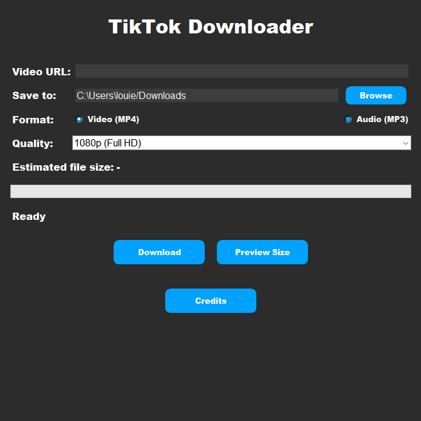

# TikTok Downloader GUI

A simple desktop application to download TikTok videos in MP4 or MP3 format.

## Features
- Download TikTok videos by pasting the URL.
- Choose between video (MP4) or audio (MP3) format.
- Select video quality (e.g., 1080p, 720p, etc.).
- Preview estimated file size before downloading.

## Requirements
- You shouldn't need to download anything extra but if it doesn't work then here's what you need

- Python 3.x
- `yt-dlp` library
- `tkinter` (usually comes pre-installed with Python)

## Installation
1. Clone this repository:git clone https://github.com/your-username/tiktok-downloader.git

2. Install the required libraries: pip install -r requirements.txt

3. Run the application: python tiktok_downloader.py

## Screenshots

## Credits
- Developed by [6tab](https://github.com/6tab).
- Built using `yt-dlp` and `tkinter`.
